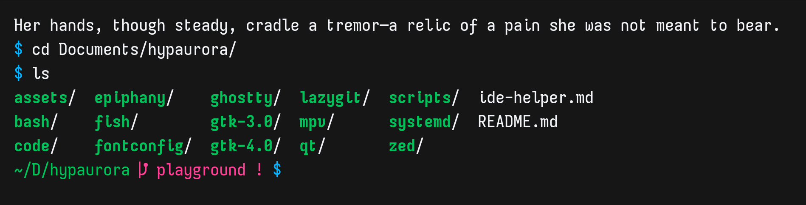

# Elephant

Elephant is my personal build of [Iosevka](https://github.com/be5invis/Iosevka), tuned for the way I like a coding font to look and feel.

It keeps Iosevka's terminal-friendly with wider spacing and more aesthetic look, gives the letterforms a little more personality: a rounded `e`, an open double-storey `g`, tailed `i` and `l`, serif details in a few places, and a handful of cursive shapes such as `v`, `w`, `x`, and `y`. The result is meant to be comfortable for long stretches in a terminal or editor without looking completely anonymous.

## Styles

Elephant currently includes:

- Weights: Regular, Medium, Bold, and ExtraBold
- Widths: Condensed, Normal, and Extended
- Slopes: Upright and Italic

The build uses Iosevka's terminal spacing, so it is suitable for editors, terminals, and other places where aligned columns matter.
